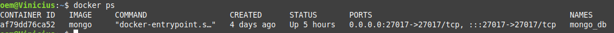

# Getting Started

I create this project to improved my skills with Spring Web Flux. is a basic CRUD but with a lot of examples of the main functionalities of the framework

To run this project is necessary had a mongo db instaled. in my development i used docker container.

After install the docker run this comands:

* docker pull mongo
* docker run -d -v mongo_db_webflux_api:/data/db --name mongo_db -p 27017:27017 mongo

If  work you will see the container up in console with this comand:

* docker ps

After that you need import the gradle project to your IDE. And run the spring boot project with java 17 or higher version.

Had one collection you can use to test the endpoints included in  '/postman-collection/UserCollection.postman_collection.json'  

### Reference Documentation
For further reference, please consider the following sections:

* [Official Gradle documentation](https://docs.gradle.org)
* [Spring Boot Gradle Plugin Reference Guide](https://docs.spring.io/spring-boot/docs/3.0.5/gradle-plugin/reference/html/)
* [Create an OCI image](https://docs.spring.io/spring-boot/docs/3.0.5/gradle-plugin/reference/html/#build-image)
* [Spring Reactive Web](https://docs.spring.io/spring-boot/docs/3.0.5/reference/htmlsingle/#web.reactive)
* [Spring Data Reactive MongoDB](https://docs.spring.io/spring-boot/docs/3.0.5/reference/htmlsingle/#data.nosql.mongodb)
* [Validation](https://docs.spring.io/spring-boot/docs/3.0.5/reference/htmlsingle/#io.validation)

### Guides
The following guides illustrate how to use some features concretely:

* [Building a Reactive RESTful Web Service](https://spring.io/guides/gs/reactive-rest-service/)
* [Accessing Data with MongoDB](https://spring.io/guides/gs/accessing-data-mongodb/)
* [Validation](https://spring.io/guides/gs/validating-form-input/)

### Additional Links
These additional references should also help you:

* [Gradle Build Scans – insights for your project's build](https://scans.gradle.com#gradle)
